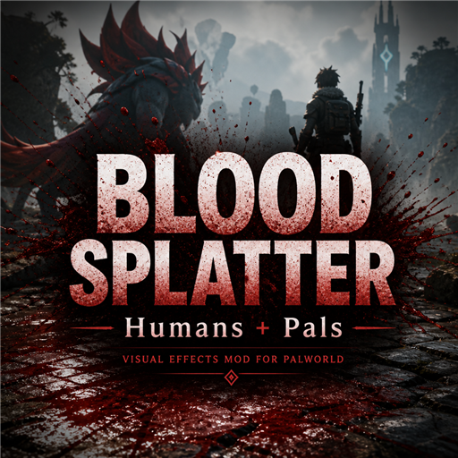

# Blood Splatter

Blood FX for **human NPCs and pals** in Palworld. Standalone UE4SS replacement for [petyr1710's Blood Splatter](https://github.com/petyr1710/blood-splatter).

| Target | Hit spray / decals | Death blood pool | Headshot decapitation |
|--------|--------------------|------------------|------------------------|
| Human NPCs | Yes | Yes | Yes |
| Pals (wild / party / base) | Death only (1.0.3+) | Yes | No |
| Player | No | No | No |

## Links

- **Steam Workshop:** https://steamcommunity.com/sharedfiles/filedetails/?id=3788875509
- **GitHub:** https://github.com/MonkeyStud-lab/palworld-blood

## Requirements

- [UE4SS Experimental (Palworld)](https://steamcommunity.com/sharedfiles/filedetails/?id=3625223587) (Steam Workshop), **or**
- [UE4SS (Experimental) (Okaetsu - RE-UE4SS)](https://www.nexusmods.com/palworld/mods/2237) (Nexus / manual)

Do **not** install Workshop UE4SS and a manual/Nexus UE4SS at the same time.

## Installation

### Steam Workshop (recommended)

1. Unsubscribe from the **original** Blood Splatter mod if you have it.
2. Subscribe to [this mod](https://steamcommunity.com/sharedfiles/filedetails/?id=3788875509) and **UE4SS Experimental (Palworld)**.
3. In-game: **Options → Mod Management** — enable both, then restart.

Package name: `BloodSplatterBoth`

### Manual

1. Remove any original Blood Splatter files (`BloodAndDecapitation` folder and `BloodFX.pak`).
2. Copy `BloodAndDecapitation` into your UE4SS `Mods` folder:
   - Workshop UE4SS: `Palworld\Mods\NativeMods\UE4SS\Mods\`
   - Manual UE4SS: e.g. `Palworld\Pal\Binaries\Win64\ue4ss\Mods\`
3. Copy `LogicMods\BloodFX.pak` into `Pal\Content\Paks\LogicMods\` (create the folder if needed).

## Debug

Press **Ctrl+F8** in-game to dump loaded character class ancestry (human / pal / player) to `UE4SS.log`.

## Credits

- Original Blood Splatter by [petyr1710](https://github.com/petyr1710/blood-splatter)
- VFX: [Realistic Blood VFX by Hivemind](https://fab.com/s/cfc2f41832a0) (via `BloodFX.pak`)

## Notes

- Client-side visuals only; does not change save data.
- Mature / gore content.
- After a Palworld update, wait for a compatible UE4SS build before using this mod.
- Pal surface wound overlays and pal decapitation are out of scope (per-species skeletons).
